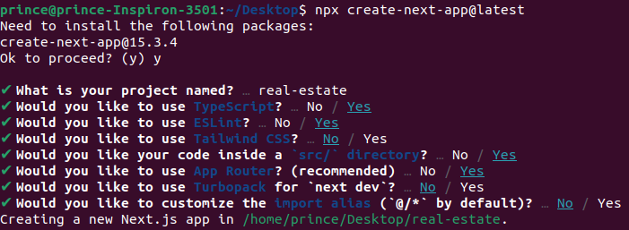
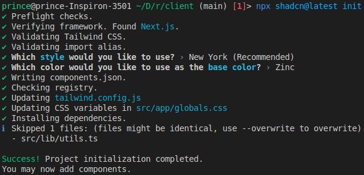

- [Real Estate](#real-estate)
  - [Client Installation](#client-installation)
  - [Install Tailwind CSS3](#install-tailwind-css3)
    - [Install Tailwind CSS](#install-tailwind-css)
    - [Configure PostCSS Plugins](#configure-postcss-plugins)
    - [Import Tailwind CSS](#import-tailwind-css)
  - [Install Shadcn/ui](#install-shadcnui)

# Real Estate

## Client Installation

- Install NextJS

```cmd
npx create-next-app@latest
```



- Install other packages

```cmd
npm i lucide-react dotenv date-fns react-filepond filepond filepond-plugin-image-exif-orientation filepond-plugin-image-preview framer-motion mapbox-gl lodash react-hook-form zod @hookform/resolvers react-redux @reduxjs/toolkit
```

- Install dev dependencies

```cmd
npm i -D @types/node @types/uuid
```

## Install Tailwind CSS3

### Install Tailwind CSS

- Install `@tailwindcss/postcss` and its peer dependencies via npm.

```cmd
npm install tailwindcss @tailwindcss/postcss postcss
```

### Configure PostCSS Plugins

- Create a `postcss.config.mjs` file in the root of your project and add the `@tailwindcss/postcss` plugin to your PostCSS configuration.

```js
const config = {
  plugins: {
    '@tailwindcss/postcss': {},
  },
};

export default config;
```

### Import Tailwind CSS

- Add an `@import` to `./src/app/globals.css` that imports Tailwind CSS.

```css
@import 'tailwindcss';
```

## Install Shadcn/ui

```cmd
npx shadcn@latest init
```



- Install all shadcn components

```cmd
npx shadcn@latest add avatar badge button card checkbox command dialog dropdown-menu form input label navigation-menu radio-group select separator sheet sidebar skeleton slider sonner switch table tabs textarea tooltip
```
